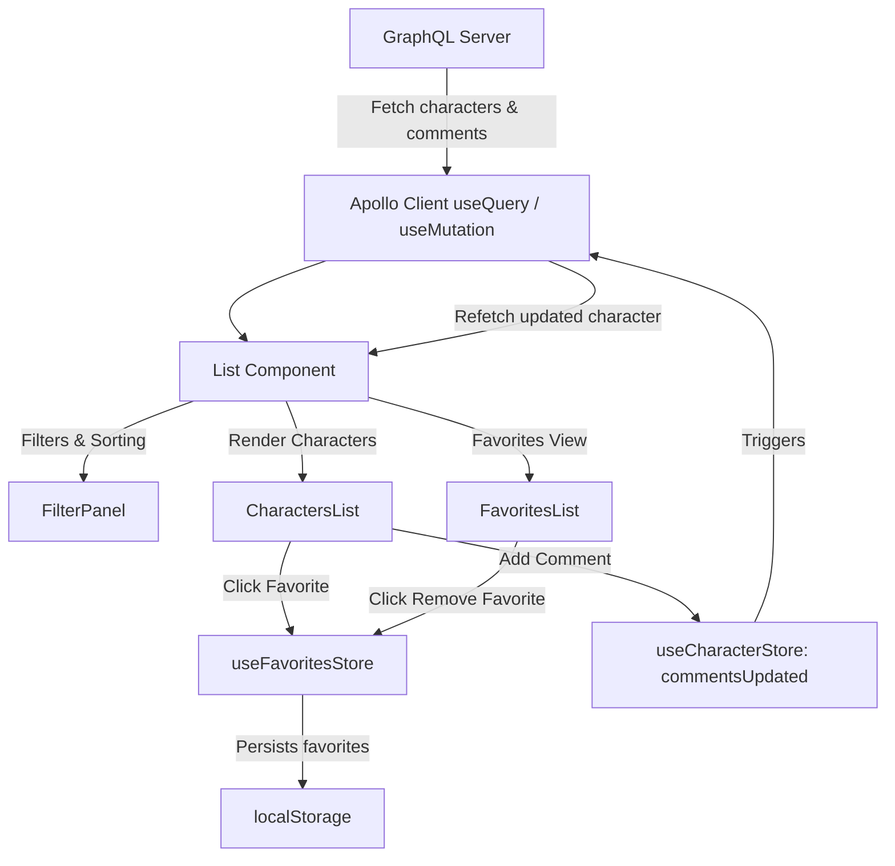

# Rick and Morty Character Explorer

Hello there, I'm Jesus and this is a React + GraphQL application to explore **Rick and Morty characters**, apply **filters and sorting**, manage **favorites**, and add **comments**.

---

## Table of Contents

1. [Project Overview](#project-overview)
2. [Technologies](#technologies)
3. [Deployment](#deployment)
4. [Backend](#backend)
5. [Frontend](#frontend)
6. [State Management](#state-management)
7. [Features](#features)
8. [Data Flow](#data-flow)
9. [Captures](#captures)

---

## Project Overview

This project allows users to:

- Browse characters from the Rick and Morty universe.
- Filter characters by **status** (Alive, Dead, Others), **species**, or **search by name**.
- Sort characters **alphabetically** (A-Z, Z-A).
- Add/remove **favorites** (stored locally using Zustand + `localStorage`).
- Comment on characters; comments update the main list and favorites in real time.
- Backend is docker friendly, so u don't need to do much.

---

## Technologies

**Frontend**

- React + TypeScript
- Tailwind CSS
- Apollo Client (GraphQL queries & mutations)
- Zustand (state management & persistence)

**Backend**

- Node.js + Express
- Apollo Server (GraphQL)
- Sequelize ORM + PostgreSQL (or SQLite for development)

---

## Deployment

Ok, first we need to clone this repo, and going to the backend and frontend folders, we need to type the good `npm install` command to install dependencies.

### Backend

1. Copy the .env sample file in root folder.
2. Start the container using `docker compose up  --build`
3. Execute the migrations and seeders:

- `sudo docker compose run api npx sequelize-cli db:migrate`
- `sudo docker compose run api npx sequelize-cli db:seed:all`
  This will migrate the models and insert the data from Rick and Morty API, after that you can check the `http://localhost:4000/graphql` and should be working fine.

Enviroment:

```
DB_USER=postgres
DB_PASSWORD=postgres
DB_NAME=rickmorty
DB_HOST=db
DB_PORT=5432
REDIS_HOST=redis
REDIS_PORT=6379
PORT=4000

```

### Frontend

1. Copy the .env sample file in root folder.
2. Start the app using `npm run dev`
3. Again, you can visit the website and start testing the API, using `http://localhost:5173/` because this is made with viste and should be working fine.

Enviroment:

```
VITE_GRAPHQL_API=http://localhost:4000/graphql

```

---

## Backend

The backend is a **GraphQL API** that provides:

- `characters`: Returns all characters with fields: `id`, `external_id`, `name`, `status`, `species`, `gender`, `image`, `origin`, and `comments`.
- `character(id: ID!)`: Returns a single character with related origin and comments.
- `commentsByCharacter(characterId: ID!)`: Returns all comments for a specific character.
- `addComment(characterId: Int!, content: String!, userId: Int)`: Creates a new comment for a character.

**Example Mutation**:

```graphql
mutation AddComment {
  addComment(characterId: 11, content: "Awesome character!", userId: null) {
    content
    characterId
  }
}
```

**Data Models**:

- **Character**: `id`, `external_id`, `name`, `species`, `status`, `gender`, `image`, `originId`
- **Origin**: `id`, `name`
- **Comment**: `id`, `characterId`, `content`, `userId`

---

## Frontend

- **List Component**: Displays the character list and integrates search, filters, sorting, and favorites.
- **FilterPanel**: Temporary state for filters; applies only on clicking "Filter".
- **CharactersList**: Renders filtered characters in a scrollable list.
- **FavoritesList**: Shows favorite characters stored in Zustand, persists in `localStorage`.
- **Card Component**: Displays character info and allows adding/removing favorites and adding comments.

---

## State Management

**Zustand Stores**:

1. **Character Store (`useCharacterStore`)**

```ts
interface CharacterState {
  selectedCharacter: ICharacter | null;
  commentsUpdated: boolean;
  setCharacter: (character: ICharacter) => void;
  clearCharacter: () => void;
  setCommentsUpdated: (val: boolean) => void;
}
```

2. **Favorites Store (`useFavoritesStore`)**

```ts
type FavoritesStore = {
  favorites: ICharacter[];
  addFavorite: (character: ICharacter) => void;
  removeFavorite: (id: string) => void;
  isFavorite: (id: string) => boolean;
};
```

**Persistence**: Favorites persist in **`localStorage`**, so the state remains between sessions.

---

## Features

- Search by character name (case-insensitive)
- Filter by **status** (`Alive`, `Dead`, `Others`)
- Filter by **species**
- Sort characters **A-Z / Z-A**
- Add/remove characters from favorites
- Add comments to characters
- Automatic update of character data and comments in favorites after a mutation

---

## Data Flow Diagram



**Explanation**:

- **GraphQL Server**: Serves characters, origins, and comments. Contains seeders and crone to get the main data from characters using the original Rick and Morty API, allowing others features like anon comments.
- **Apollo Client**: Handles queries (`useQuery`) and mutations (`useMutation`) for comments.
- **List Component**: Main UI, renders characters, filters, sorting, and favorites. In adition I used new buttons to sort the data like A-Z and Z-A in the filters component.
- **FilterPanel**: Temporarily stores filter state, applies on "Filter" button click.
- **CharactersList / FavoritesList**: Render characters. Favorites list is persistent and independent.
- **useFavoritesStore**: Manages favorites with local persistence.
- **useCharacterStore**: Manages selected character and triggers updates on comments.
- **useCharacterStore**: I decided to use anonymous comments, cause is more flexible to making some tests in short time.

## Captures

<div style="text-align: center;">
  
</div>

<br />

<div style="text-align: center;">
  
</div>

<br />

<div style="text-align: center;">
  
</div>

<br />

<div style="text-align: center;">
  
</div>
